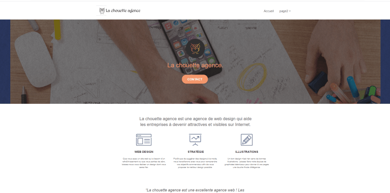

# La chouette agence

## Projet 4 de la formation : Developpeur Web

## Optimiser un site web existant

La chouette agence est une grande agence de web design basée à Lyon. L’activité de l’entreprise a bien démarré mais aujourd’hui, elle est en perte de vitesse.

La premiere étape est de réaliser Analyse de l’état actuel de SEO du site pour pouvoir appliquer les ameliorations nécessaires, puis vérifier et accelerer la vitesse de chargement du site

---

### Dans le cadre du projet, je dois optimiser le site pour un meilleur _référencement_

    Compétences évaluées :

        * Assurer l'accessibilité d'un site web
        * Écrire un code HTML et CSS maintenable
        * Optimiser la taille et la vitesse d’un site web
        * Réaliser une recherche des bonnes pratiques en développement web
        * Optimiser le référencement d'un site web

### Lien vers le site [La chouette agence](https://fab33500.github.io/LauretFabrice_4_11082021/)

